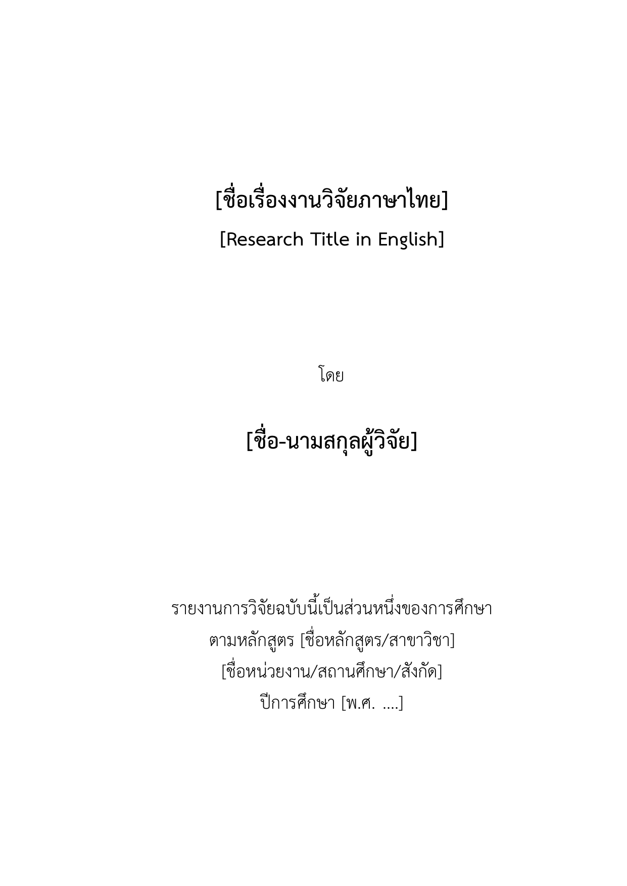
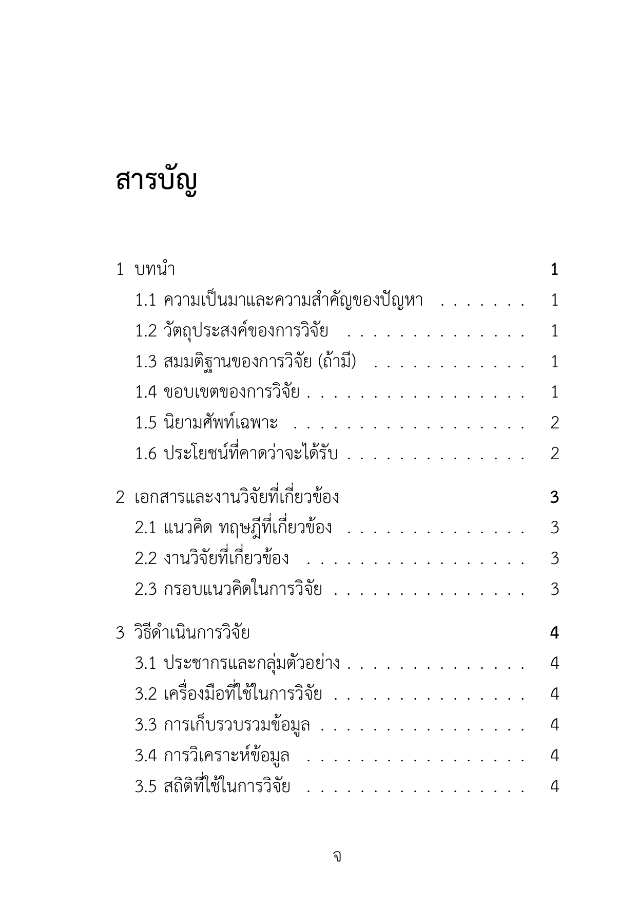
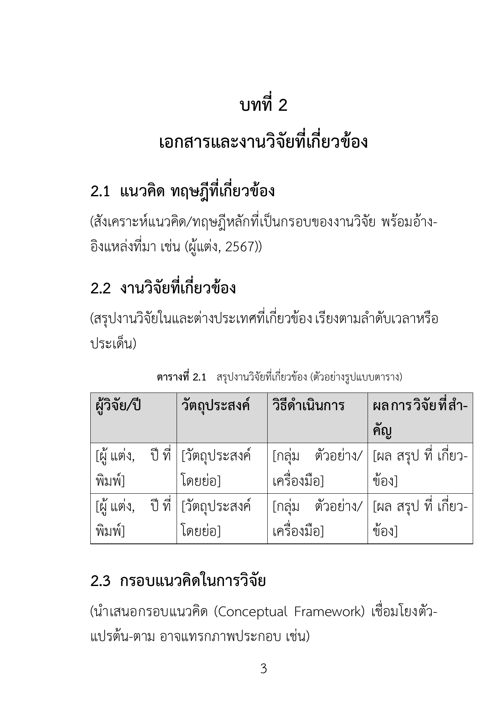
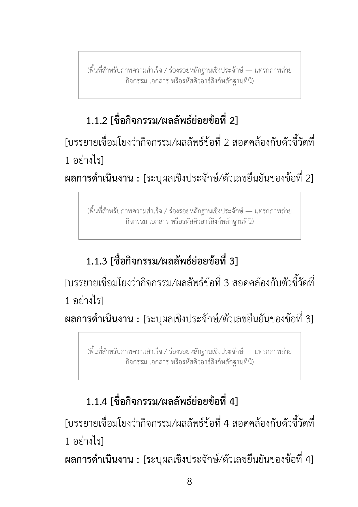
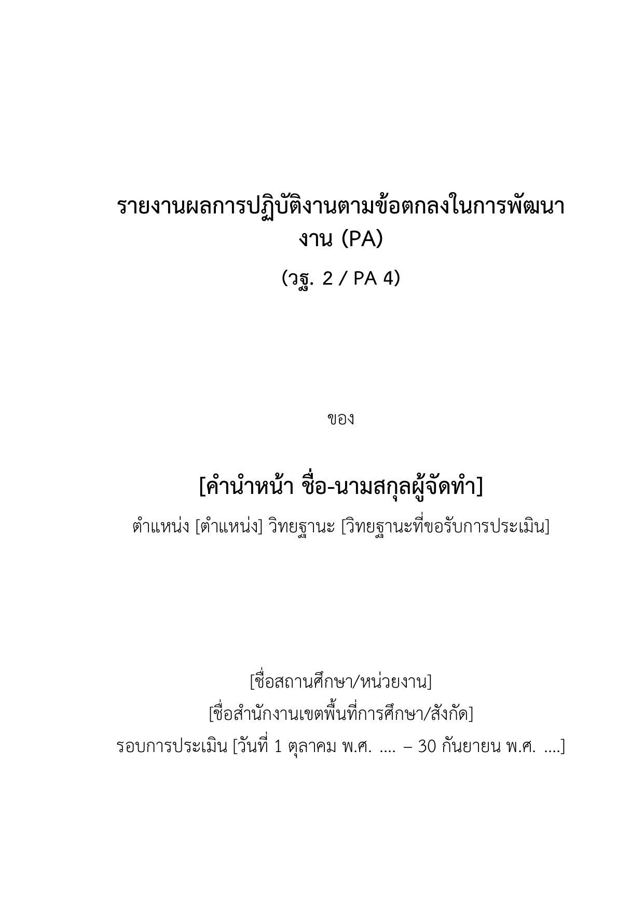
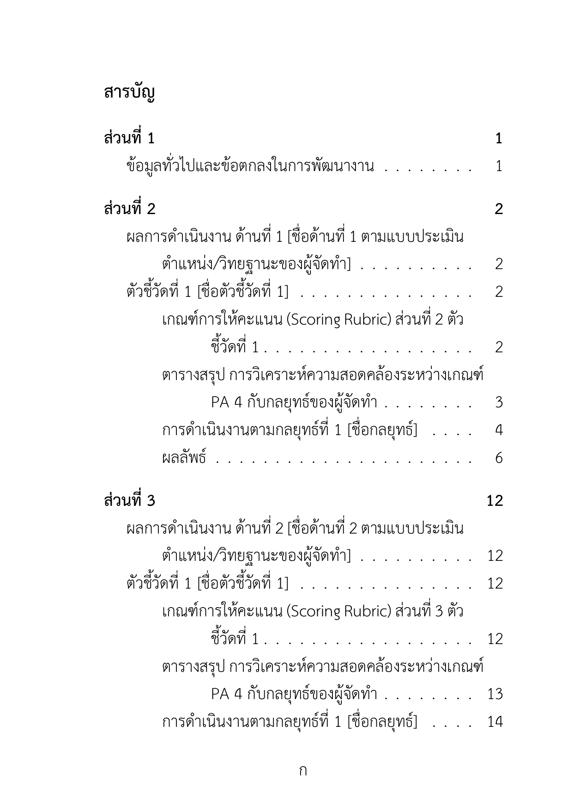
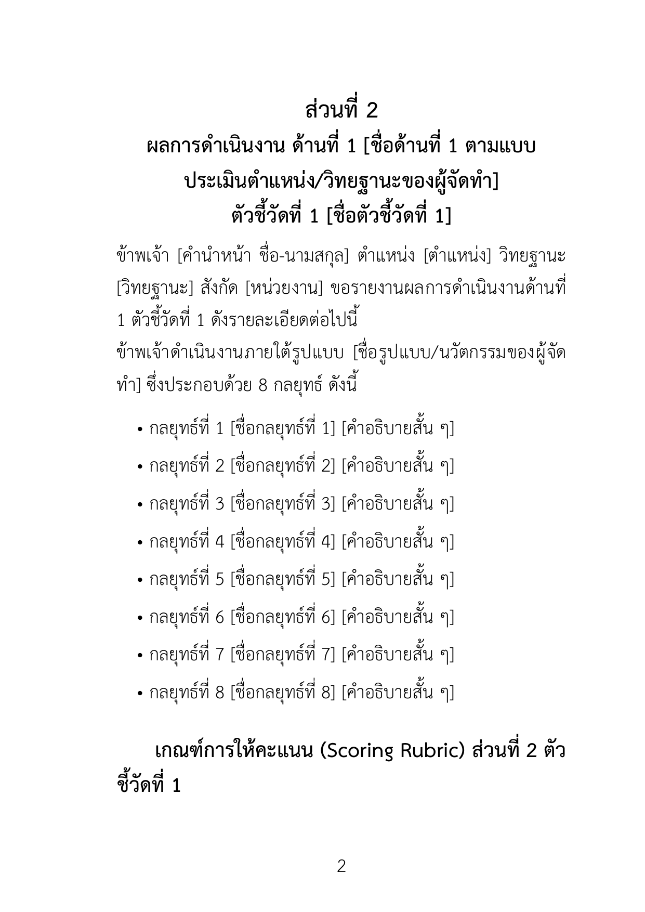
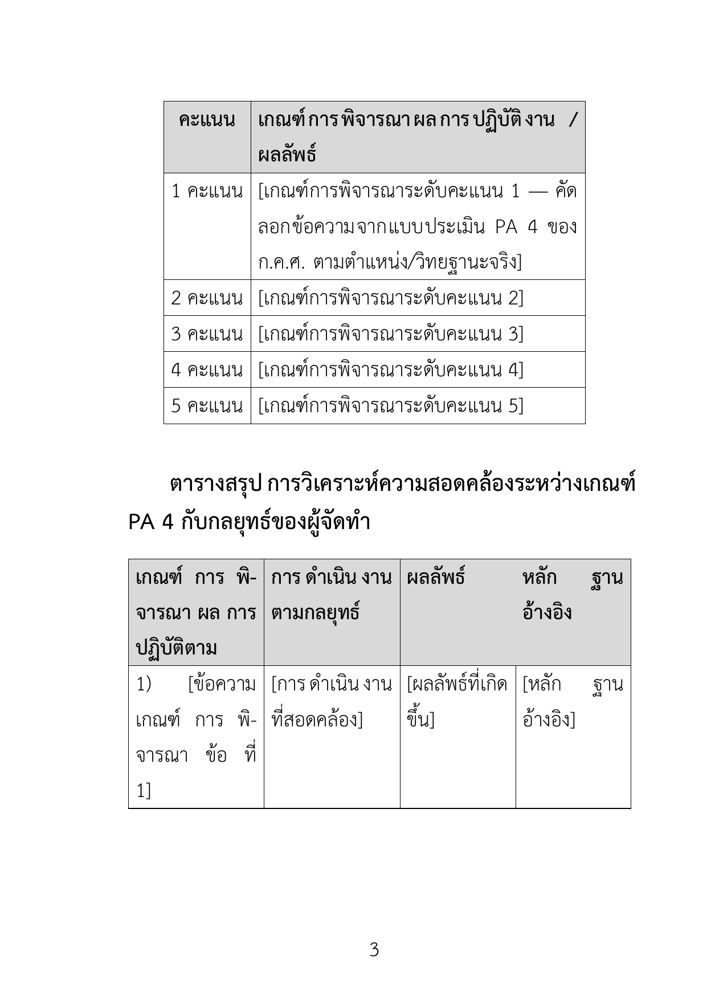
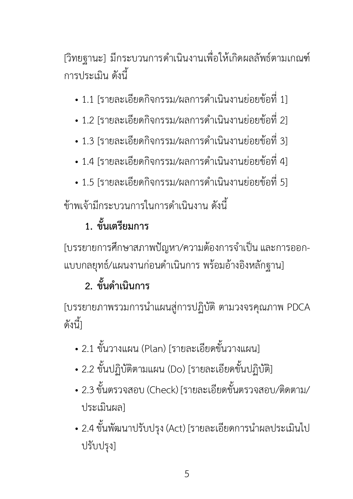
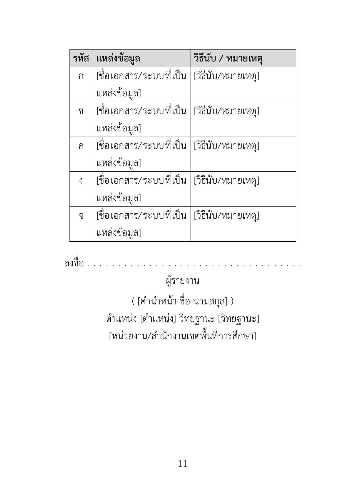

# คู่มือการใช้งานเทมเพลต Word และ LaTeX โดยละเอียด

คู่มือนี้อธิบายวิธีใช้งานเทมเพลตทั้ง 2 รูปแบบที่ให้มา — **Word (.docx)** และ
**LaTeX (Overleaf/TeXstudio)** — ตั้งแต่การติดตั้ง การแก้ไขเนื้อหา ไปจนถึงการแก้ปัญหา
ที่พบบ่อย พร้อมภาพตัวอย่างหน้าเอกสารจริงที่ Render ออกมาประกอบทุกขั้นตอน

> **หมายเหตุเรื่องฟอนต์ในภาพตัวอย่าง**: ภาพตัวอย่างทั้งหมดในคู่มือนี้ Render จาก
> เทมเพลต LaTeX โดยใช้ฟอนต์ไทยสำรอง **"Laksaman"** แทน **TH Sarabun New**
> เนื่องจากเครื่องมือที่ใช้สร้างภาพตัวอย่างไม่มีไฟล์ฟอนต์ TH Sarabun New ติดตั้งอยู่
> อย่างไรก็ตาม **โครงสร้าง ระยะขอบ ขนาดตัวอักษร และรูปแบบตาราง จะเหมือนกัน
> ทุกประการ** กับเมื่อใช้ฟอนต์ TH Sarabun New จริงตามที่เทมเพลตกำหนดไว้เป็นค่าเริ่มต้น
> (ทั้งไฟล์ Word และ LaTeX)

---

## สารบัญคู่มือ

1. [ภาพรวมของชุดเทมเพลต](#1-ภาพรวมของชุดเทมเพลต)
2. [การใช้งานเทมเพลต Word](#2-การใช้งานเทมเพลต-word)
3. [การใช้งานเทมเพลต LaTeX (Overleaf / TeXstudio)](#3-การใช้งานเทมเพลต-latex-overleaf--texstudio)
4. [คำอธิบายระบบเลขหน้า ก ข ค / 1 2 3](#4-คำอธิบายระบบเลขหน้า-ก-ข-ค--1-2-3)
5. [การแก้ปัญหาที่พบบ่อย (Troubleshooting)](#5-การแก้ปัญหาที่พบบ่อย-troubleshooting)
6. [เปรียบเทียบ Word กับ LaTeX — ควรเลือกใช้แบบไหน](#6-เปรียบเทียบ-word-กับ-latex--ควรเลือกใช้แบบไหน)

---

## 1. ภาพรวมของชุดเทมเพลต

ชุดเทมเพลตนี้มีไฟล์ทำงานที่เกี่ยวข้องกันอยู่ 4 กลุ่มในโฟลเดอร์
`templates/thai-academic-templates/`:

```
templates/thai-academic-templates/
├── analysis/STRUCTURE_ANALYSIS.md      ← ผลวิเคราะห์โครงสร้างจากไฟล์ตัวอย่าง PA4
├── docx_generator/                     ← สคริปต์ python-docx (สร้างไฟล์ .docx)
├── output/                             ← ไฟล์ .docx ที่สร้างไว้แล้ว พร้อมใช้งานทันที
├── latex/5chapter/ , latex/pa/         ← ซอร์สโค้ด LaTeX สำหรับ Overleaf/TeXstudio
└── docs/                               ← คู่มือฉบับนี้ + ภาพตัวอย่าง
```

**สองเทมเพลต** ที่ให้มาคือ:

| เทมเพลต | ใช้สำหรับ |
|---|---|
| **5-Chapter-Research-Template** | งานวิจัย 5 บทตามมาตรฐานวิชาการไทย (ปก → บทคัดย่อ → สารบัญ → บทที่ 1-5 → บรรณานุกรม → ภาคผนวก) |
| **PA-Academic-Report-Template** | ผลงานทางวิชาการ/รายงานผลการปฏิบัติงานตามข้อตกลง PA (ส่วนที่ 1 → ส่วนที่ 2 ด้านที่ 1 → ส่วนที่ 3 ด้านที่ 2 → ภาคผนวก) |

ทั้งสองมีให้เลือกใช้ **2 รูปแบบไฟล์**: Word (.docx) และ LaTeX — เนื้อหา/โครงสร้าง/
การจัดหน้าเหมือนกันทุกประการ ต่างกันแค่เครื่องมือที่ใช้พิมพ์

---

## 2. การใช้งานเทมเพลต Word

### 2.1 วิธีที่ 1 — ใช้ไฟล์ .docx ที่สร้างไว้แล้ว (ง่ายที่สุด)

ไฟล์พร้อมใช้อยู่ในโฟลเดอร์ `output/`:

- `5-Chapter-Research-Template.docx`
- `PA-Academic-Report-Template.docx`

เปิดไฟล์ด้วย **Microsoft Word** ได้ทันที ไม่ต้องติดตั้งอะไรเพิ่ม

### 2.2 วิธีที่ 2 — รันสคริปต์ python-docx เอง (กรณีต้องการปรับโครงสร้าง)

```bash
cd templates/thai-academic-templates/docx_generator
pip install python-docx pythainlp
python build_5chapter_template.py    # สร้างไฟล์งานวิจัย 5 บท
python build_pa_template.py          # สร้างไฟล์รายงาน PA
```

ไฟล์ผลลัพธ์จะถูกเขียนทับที่ `../output/*.docx` ทุกครั้งที่รัน — เหมาะกับกรณีที่ต้องการ
แก้ไข "โครงสร้าง" เทมเพลต (เช่น เปลี่ยนจำนวนเกณฑ์จาก 5 เป็น 6 ข้อ) โดยแก้ไขโค้ดใน
`build_5chapter_template.py` / `build_pa_template.py` แล้วรันสคริปต์ใหม่

### 2.3 หน้าตาของไฟล์ที่ได้ (ภาพตัวอย่าง)

**หน้าปก** — ข้อความในวงเล็บเหลี่ยม `[ ... ]` คือจุดที่ต้องพิมพ์แทนที่ด้วยข้อมูลจริง
(ชื่อเรื่อง ชื่อผู้วิจัย ปีการศึกษา ฯลฯ):



**สารบัญ** — ใช้ฟีลด์ TOC ของ Word ทำให้เมื่อพิมพ์เนื้อหาเสร็จแล้วสามารถอัปเดตเลขหน้า
ในสารบัญได้อัตโนมัติ (ไม่ต้องนับเอง):



**ตาราง** — ทุกตารางในเทมเพลตใช้รูปแบบเดียวกัน: เส้นขอบเต็ม หัวตารางตัวหนาพื้นเทาอ่อน
ตรงตามไฟล์ PA4 ตัวอย่างที่แนบมา:



**กล่อง Placeholder สำหรับแทรกภาพหลักฐาน** (พบในเทมเพลต PA) — เป็นกรอบสี่เหลี่ยม
เตือนให้แทรกภาพถ่ายกิจกรรม/หลักฐานตรงจุดนั้น:



### 2.4 ขั้นตอนการแก้ไขเนื้อหา

1. **Find & Replace** (Ctrl+H) เพื่อค้นหาข้อความในวงเล็บเหลี่ยม เช่น
   `[ชื่อเรื่องงานวิจัยภาษาไทย]` แล้วพิมพ์ชื่อเรื่องจริงแทนที่ ทำแบบนี้ทีละจุด
   หรือเปิดอ่านทั้งเล่มแล้วแก้ไปทีละหน้าก็ได้
2. **อัปเดตสารบัญ**: คลิกขวาบนสารบัญ (หรือกด Ctrl+A ทั้งเอกสารแล้วกด F9) แล้วเลือก
   **Update Field > Update entire table** เพื่อให้เลขหน้าตรงกับเนื้อหาจริง
3. **เพิ่ม/ลบแถวตาราง**: คลิกในตาราง แล้วใช้แท็บ **Table Design / Layout** ของ Word
   ตามปกติ — รูปแบบเส้นขอบ/สีพื้นจะคงเดิมโดยอัตโนมัติเมื่อเพิ่มแถวใหม่ต่อจากแถวเดิม
4. **แทรกภาพหลักฐานจริง** แทนที่กล่อง placeholder: คลิกเลือกกล่องข้อความ ลบข้อความ
   ตัวอย่างออก แล้วแทรกภาพผ่านเมนู **Insert > Pictures**
5. **สำหรับเทมเพลต PA**: เมื่อจะเพิ่ม "ด้านที่ 3" หรือตัวชี้วัดอื่น ๆ ให้คัดลอกทั้งบล็อก
   ตั้งแต่หัวข้อ "ส่วนที่ N" จนถึงบล็อกลงชื่อผู้รายงาน แล้ววางต่อท้าย จากนั้นแก้ไขเลขที่ส่วน/
   ด้าน/ตัวชี้วัดและเนื้อหาให้ตรงกับความจริง

---

## 3. การใช้งานเทมเพลต LaTeX (Overleaf / TeXstudio)

### 3.1 โครงสร้างไฟล์

```
latex/5chapter/                    latex/pa/
├── main.tex        ← ไฟล์หลัก     ├── main.tex
├── preamble.tex    ← ตั้งค่าฟอนต์/ ├── preamble.tex
│                     ขอบกระดาษ/   ├── cover.tex
│                     เลขหน้า      ├── part1_general.tex
├── cover.tex                      ├── part2_domain1.tex  ← ต้นแบบทำซ้ำ
├── approval.tex                   ├── part3_domain2.tex     ด้าน/ตัวชี้วัด
├── abstract_th.tex, abstract_en.tex ├── appendix.tex
├── acknowledgement.tex            └── fonts/  ← วางไฟล์ฟอนต์ที่นี่
├── chapters/chapter1.tex ... chapter5.tex
├── bibliography.tex, appendix.tex, cv.tex
├── references.bib
└── fonts/  ← วางไฟล์ฟอนต์ที่นี่
```

แต่ละ "ส่วน" ของเอกสารแยกเป็นคนละไฟล์ `.tex` ต่างหาก แล้วให้ `main.tex` เรียกรวมกัน
ด้วยคำสั่ง `\input{...}` — **แก้ไขเนื้อหาแค่ไฟล์ย่อยที่เกี่ยวข้อง ไม่ต้องแตะ main.tex**

### 3.2 ขั้นตอนใช้งานบน Overleaf (แนะนำสำหรับผู้เริ่มต้น)

1. ไปที่ [overleaf.com](https://www.overleaf.com) → **New Project > Upload Project**
   แล้วเลือกทั้งโฟลเดอร์ `latex/5chapter/` หรือ `latex/pa/` (บีบอัดเป็น .zip ก่อนอัปโหลด)
2. เมนู **Menu (มุมซ้ายบน) > Compiler** เปลี่ยนจาก pdfLaTeX เป็น **XeLaTeX**
   (จำเป็นมาก เพราะเทมเพลตนี้ใช้ `fontspec`/`polyglossia` สำหรับภาษาไทย)
3. นำไฟล์ฟอนต์ **TH Sarabun New** (`.ttf` 4 ไฟล์: ปกติ/ตัวหนา/ตัวเอียง/ตัวหนา-เอียง)
   ไปอัปโหลดใส่โฟลเดอร์ `fonts/` ในโปรเจกต์ Overleaf
   (ดาวน์โหลดฟรีได้จากเว็บฟอนต์ไทยทั่วไป เช่น f0nt.com หรือเว็บของ SIPA)
   - ถ้ายังไม่มีไฟล์ฟอนต์ ให้เปิด `preamble.tex` แล้วแก้บรรทัด
     `\setmainfont{TH Sarabun New}[...]` เป็น `\setmainfont{Sarabun}` ชั่วคราว
     (ฟอนต์ Sarabun มีอยู่แล้วในระบบฟอนต์ของ Overleaf)
4. กด **Recompile** — สำหรับเทมเพลต 5 บทที่มีบรรณานุกรม ต้องกด Recompile **2 ครั้ง**
   (ครั้งแรกให้ Overleaf รัน biber ประมวลผลบรรณานุกรม ครั้งที่สองจึงจะขึ้นสารบัญ/
   การอ้างอิงครบถ้วน — Overleaf จัดการเรื่องนี้ให้อัตโนมัติเมื่อกด Recompile ซ้ำ)

### 3.3 ขั้นตอนใช้งานบน TeXstudio (เครื่องตนเอง)

ต้องติดตั้ง TeX Live หรือ MiKTeX ที่มีคำสั่ง `xelatex` และ `biber`:

```bash
xelatex main.tex
biber main        # เฉพาะเทมเพลต 5chapter ที่มีบรรณานุกรม
xelatex main.tex
xelatex main.tex  # รันซ้ำให้สารบัญ/การอ้างอิงครบ
```

ตั้งค่าใน TeXstudio ที่ **Options > Configure TeXstudio > Build > Default Compiler**
ให้เลือก **XeLaTeX**

### 3.4 หน้าตาของไฟล์ที่คอมไพล์ได้ (ภาพตัวอย่าง — ทดสอบคอมไพล์จริงแล้ว)

**หน้าปกและสารบัญของเทมเพลต PA**:

| หน้าปก | สารบัญ |
|---|---|
|  |  |

**หัวข้อ "ส่วนที่ 2" พร้อมรายการกลยุทธ์แบบ bullet** (สร้างจาก `part2_domain1.tex`
โดยใช้มาโคร `\paparttitle` / `\padomaintitle` ที่กำหนดไว้ใน `preamble.tex`):



**ตารางเกณฑ์การให้คะแนน** (สร้างด้วย `longtable` + มาโคร `\tblhead` ที่ให้พื้นหลังสีเทา
กับหัวตารางโดยอัตโนมัติ):



**ขั้นตอน PDCA** (ขั้นเตรียมการ / ขั้นดำเนินการ 2.1-2.4 / ขั้นจัดทำรายงาน):



**ตารางแหล่งข้อมูลสำหรับตรวจสอบ พร้อมบล็อกลงชื่อผู้รายงาน**:



### 3.5 คำสั่งสำคัญที่ควรรู้จักก่อนแก้ไข

| คำสั่ง (นิยามใน `preamble.tex`) | หน้าที่ |
|---|---|
| `\thaifrontmatter` | เริ่มเลขหน้าพยัญชนะไทย ก ข ค ... (เรียกหลังหน้าปก) |
| `\mainbodymatter` | เปลี่ยนเป็นเลขอารบิก 1 2 3 ... นับใหม่จาก 1 (เรียกก่อนบทที่ 1 หรือก่อนส่วนที่ 2) |
| `\hOneSize` / `\hTwoSize` / `\hThreeSize` | ขนาดตัวอักษรหัวข้อระดับ 1/2/3 (20/18/16pt ตัวหนา) |
| `\tblhead{ข้อความ}` | ใส่ในหัวตารางเพื่อให้ได้พื้นเทา + ตัวหนาอัตโนมัติ |
| `\paphotobox` (เฉพาะเทมเพลต PA) | วาดกล่อง placeholder สำหรับแทรกภาพหลักฐาน |
| `\padisclaimer` (เฉพาะเทมเพลต PA) | พิมพ์ข้อความเตือน "ตัวเลขในตารางนี้เป็นข้อมูลสมมุติ" |
| `\pasignatureblock{ชื่อ}{ตำแหน่ง}{หน่วยงาน}` | พิมพ์บล็อกลงชื่อผู้รายงาน |

### 3.6 การเพิ่ม "ด้าน/ตัวชี้วัด" ใหม่ในเทมเพลต PA

ไฟล์ `part2_domain1.tex` และ `part3_domain2.tex` มีโครงสร้างเหมือนกันทุกประการ
(เป็นแม่แบบที่ทำซ้ำได้) หากต้องการเพิ่ม "ด้านที่ 3":

1. คัดลอกไฟล์ `part3_domain2.tex` เป็น `part4_domain3.tex`
2. แก้ไขข้อความ `ส่วนที่ 3` → `ส่วนที่ 4` และ `ด้านที่ 2` → `ด้านที่ 3` ในไฟล์ใหม่
3. เปิด `main.tex` แล้วเพิ่มบรรทัด `\input{part4_domain3}` ต่อจาก
   `\input{part3_domain2}`

---

## 4. คำอธิบายระบบเลขหน้า ก ข ค / 1 2 3

ทั้งไฟล์ Word และ LaTeX ใช้กลไกที่เป็น **มาตรฐานของตัวโปรแกรมเอง** ไม่ใช่การพิมพ์
ตัวอักษรปลอมด้วยมือ:

- **Word**: ใช้แอตทริบิวต์ `w:pgNumType/@w:fmt="thaiLetters"` ของไฟล์ .docx
  (รูปแบบเลขหน้ามาตรฐานของ Word เอง ถ้าเปิดเมนู **Insert > Page Number >
  Format Page Numbers** จะเห็นตัวเลือก "ก, ข, ค, ..." อยู่แล้วในดรอปดาวน์
  Number format — เทมเพลตนี้แค่ตั้งค่านี้ไว้ล่วงหน้าให้)
- **LaTeX**: ใช้มาโคร `\ThaiFrontPage{n}` ที่นิยามไว้ใน `preamble.tex`
  ซึ่งดึงพยัญชนะไทยจากลำดับ ก ข ค ง จ ฉ ช ซ ... มาแทน `\thepage` ในส่วนหน้า

**การแบ่งส่วน** (ทั้งสองรูปแบบไฟล์ใช้หลักการเดียวกัน):

```
[ปก]  →  ไม่แสดงเลขหน้า
[ส่วนหน้า: ใบรับรอง/บทคัดย่อ/สารบัญ]  →  ก, ข, ค, ง, ... (นับใหม่จาก 1)
[บทที่ 1 เป็นต้นไป]  →  1, 2, 3, ... (นับใหม่จาก 1)
```

ทดสอบคอมไพล์เทมเพลต LaTeX จริงแล้วยืนยันว่าเลขหน้าที่ท้ายกระดาษของแต่ละหน้า
เรียงตามลำดับนี้ถูกต้องทุกหน้า

---

## 5. การแก้ปัญหาที่พบบ่อย (Troubleshooting)

### 5.1 Word: สารบัญ/เลขหน้าไม่อัปเดตตามเนื้อหาที่แก้ไข

กด **Ctrl+A** เลือกทั้งเอกสาร แล้วกด **F9** (Update Field) หรือคลิกขวาที่สารบัญแล้ว
เลือก **Update Field > Update entire table**

### 5.2 Word: ข้อความภาษาไทยยาว ๆ ในตารางไม่ตัดบรรทัด ล้นออกนอกช่อง

ปกติ Word จะตัดคำภาษาไทยได้เองเมื่อตั้งค่าภาษาของข้อความเป็นภาษาไทยถูกต้อง
(เทมเพลตนี้ตั้งค่านี้ให้แล้วโดยอัตโนมัติทุก run) หากยังพบปัญหาในเครื่องบางเครื่อง
ให้ลองปิด-เปิดไฟล์ใหม่ หรือเลือกข้อความในช่องนั้นแล้วตรวจสอบที่
**Review > Language** ว่าตั้งเป็น **Thai** อยู่

### 5.3 LaTeX: ข้อความภาษาไทยในตาราง/กล่องแคบ ๆ ไม่ขึ้นบรรทัดใหม่ ล้นทะลุกรอบ

นี่คือปัญหาที่พบระหว่างการพัฒนาเทมเพลตนี้ และได้แก้ไขไว้แล้วใน `preamble.tex`
ด้วยคำสั่ง:

```latex
\XeTeXlinebreaklocale "th"
\XeTeXlinebreakskip = 0pt plus 1pt minus 0.1pt
```

คำสั่งนี้เปิดใช้การตัดคำภาษาไทยแบบพจนานุกรมของ XeTeX (ผ่านไลบรารี ICU) ซึ่ง
**จำเป็นมาก** เพราะปกติ LaTeX จะตัดบรรทัดเฉพาะตรงช่องว่างเท่านั้น แต่ภาษาไทย
ไม่มีช่องว่างระหว่างคำ ถ้าไม่เปิดคำสั่งนี้ ข้อความไทยในช่องตารางแคบ ๆ จะกลายเป็น
"คำยาวคำเดียว" ที่ตัดไม่ได้เลยและล้นออกนอกกรอบทันที

**ถ้ายังพบปัญหานี้อยู่** ให้ตรวจสอบว่า:
1. คอมไพล์ด้วย **XeLaTeX** เท่านั้น (คำสั่งนี้เป็นฟีเจอร์เฉพาะของ XeTeX ใช้กับ
   pdfLaTeX ไม่ได้)
2. สองบรรทัดข้างต้นยังอยู่ใน `preamble.tex` (ใกล้กับ `\usepackage{polyglossia}`)
   ไม่ได้ถูกลบหรือคอมเมนต์ออกไปโดยไม่ได้ตั้งใจ

### 5.4 LaTeX: ฟอนต์ "TH Sarabun New" หาไม่เจอ (font not found)

ต้องอัปโหลดไฟล์ฟอนต์ `.ttf` ใส่โฟลเดอร์ `fonts/` ก่อน (ดูข้อ 3.2 ข้อ 3) หรือสลับไปใช้
ฟอนต์สำรอง `Sarabun` ชั่วคราวตามที่อธิบายไว้ในหมายเหตุของ `preamble.tex`

### 5.5 LaTeX: บรรณานุกรมของเทมเพลต 5 บทไม่ขึ้น หรือขึ้นเป็น `[?]`

ต้องรันตามลำดับ `xelatex → biber → xelatex → xelatex` ครบทั้ง 4 ขั้นตอน (บน Overleaf
แค่กด Recompile 2 ครั้งติดกัน ระบบจะรัน biber ให้อัตโนมัติในระหว่างนั้น)

---

## 6. เปรียบเทียบ Word กับ LaTeX — ควรเลือกใช้แบบไหน

| ประเด็น | Word (.docx) | LaTeX |
|---|---|---|
| ความคุ้นเคย | ผู้ใช้ทั่วไปคุ้นเคยอยู่แล้ว แก้ไขง่ายทันที | ต้องเรียนรู้ไวยากรณ์ LaTeX เบื้องต้น |
| ความสวยงาม/ความสม่ำเสมอ | ดีมาก แต่ผู้ใช้อาจพลาดแก้ format โดยไม่ตั้งใจ | สม่ำเสมอสูงมาก แก้เนื้อหาไม่กระทบ format |
| การแก้ไขโครงสร้างจำนวนมาก (เช่น เพิ่มด้าน/ตัวชี้วัดหลายสิบรายการ) | ต้องคัดลอก-วางด้วยมือทีละส่วน | แก้สคริปต์/คัดลอกไฟล์ .tex แล้วสร้างใหม่ได้เร็วกว่า |
| การทำงานร่วมกันแบบออนไลน์ | ใช้ Word Online / Google Docs (แปลงไฟล์) | ใช้ Overleaf ทำงานพร้อมกันได้จริง มีประวัติการแก้ไข |
| เหมาะกับ | ครู/บุคลากรที่ต้องยื่นเอกสารเร็ว คุ้นเคยกับ Word | ผู้ที่ต้องการควบคุมรูปแบบละเอียด/ทำเทมเพลตให้คนอื่นใช้ต่อ |

**คำแนะนำ**: หากต้องการยื่นเอกสารเร็วและคุ้นเคยกับ Word อยู่แล้ว ให้ใช้ไฟล์ .docx
ในโฟลเดอร์ `output/` ได้ทันที ส่วน LaTeX เหมาะกับกรณีที่ต้องทำเอกสารจำนวนมาก
ที่มีโครงสร้างซ้ำ ๆ กัน (เช่น สร้างรายงาน PA ให้บุคลากรหลายคนจากแม่แบบเดียวกัน)
หรือต้องการควบคุมความสม่ำเสมอของรูปแบบเอกสารอย่างเข้มงวด
